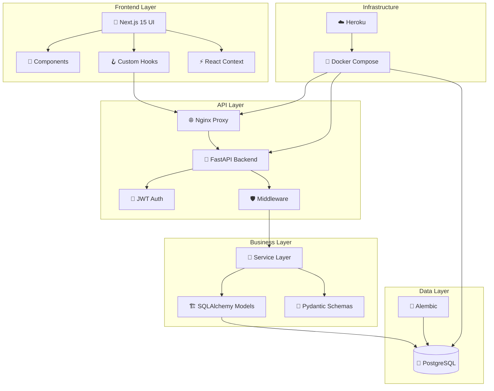
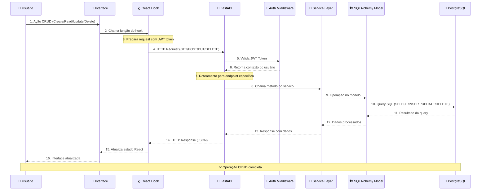
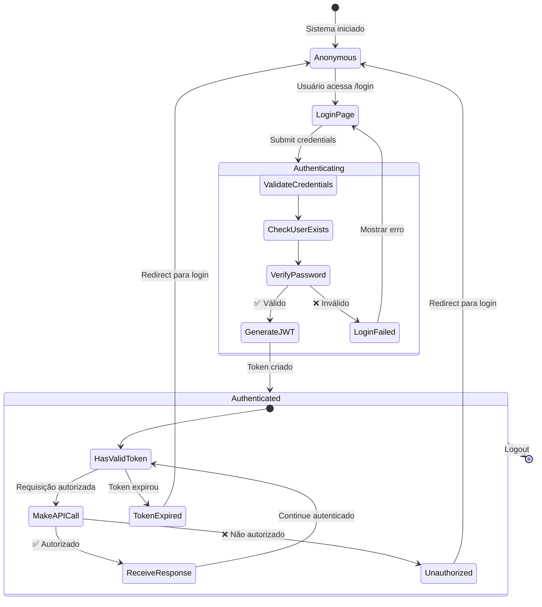
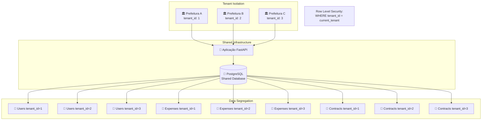
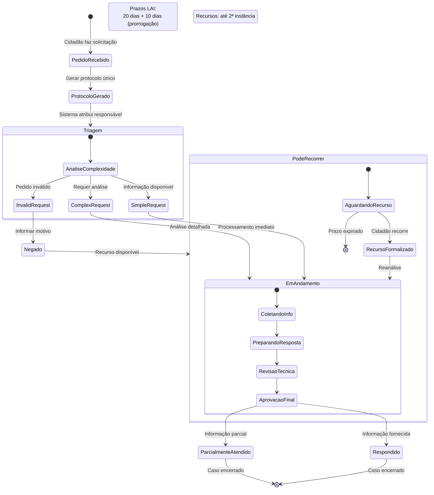
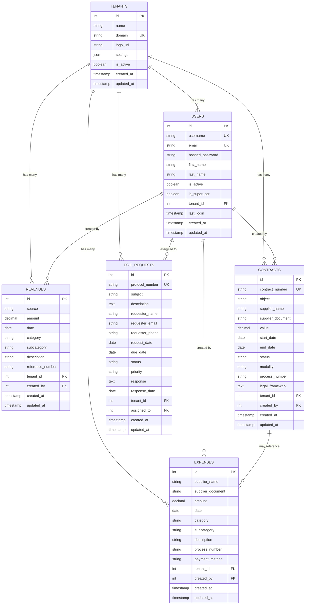
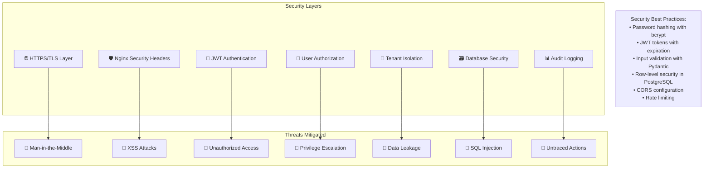
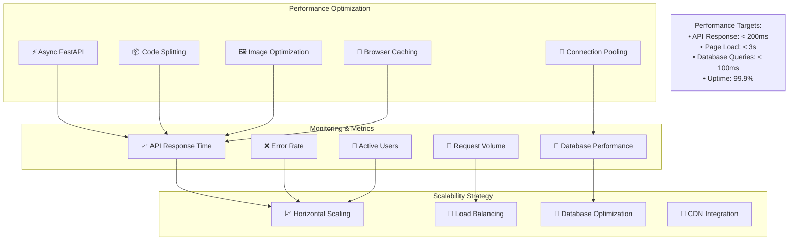
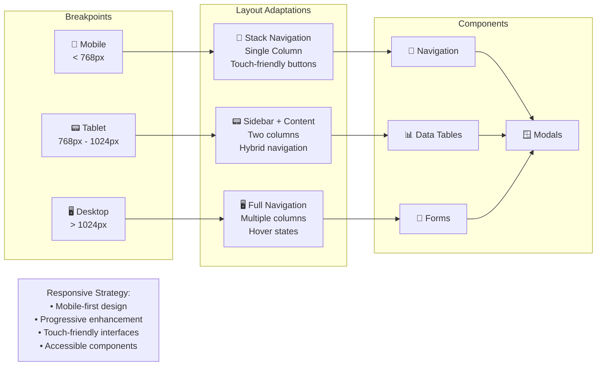

# 🏗️ Arquitetura do Sistema - Diagramas Técnicos

## 📊 Visão Geral da Arquitetura



## 🔄 Fluxo de Dados CRUD Detalhado



## 🔐 Fluxo de Autenticação Completo



## 🏢 Arquitetura Multi-Tenant



## 📋 Fluxo e-SIC (Lei de Acesso à Informação)



## 🔄 Deploy e CI/CD Pipeline

```mermaid
graph LR
    subgraph "Development"
        DEV[👨‍💻 Developer]
        GIT[📁 Git Repository]
    end
    
    subgraph "CI/CD Pipeline"
        GHA[🚀 GitHub Actions]
        TEST[🧪 Automated Tests]
        BUILD[🔨 Docker Build]
        DEPLOY[📦 Deploy]
    end
    
    subgraph "Environments"
        STAGING[🔧 Staging]
        PROD[🌟 Production]
    end
    
    subgraph "Infrastructure"
        HEROKU[☁️ Heroku]
        POSTGRES[🐘 PostgreSQL]
        NGINX[🌐 Nginx]
    end
    
    DEV --> GIT: Push code
    GIT --> GHA: Trigger workflow
    GHA --> TEST: Run tests
    TEST --> BUILD: ✅ Tests pass
    BUILD --> DEPLOY: 🐳 Docker image ready
    
    DEPLOY --> STAGING: Deploy to staging
    STAGING --> PROD: Manual approval
    
    PROD --> HEROKU
    HEROKU --> POSTGRES
    HEROKU --> NGINX
    
    Note1[Continuous Integration:<br/>Automated testing<br/>Code quality checks]
    Note2[Continuous Deployment:<br/>Zero-downtime deployment<br/>Rollback capability]
```

## 📊 Modelo de Dados Completo



## 🔒 Camadas de Segurança



## 🚀 Performance e Escalabilidade



## 📱 Fluxo de Responsividade



---

Esta documentação arquitetural serve como guia técnico para desenvolvedores, fornecendo uma visão completa dos padrões, fluxos e decisões arquiteturais do sistema SaaS de Transparência Pública.
