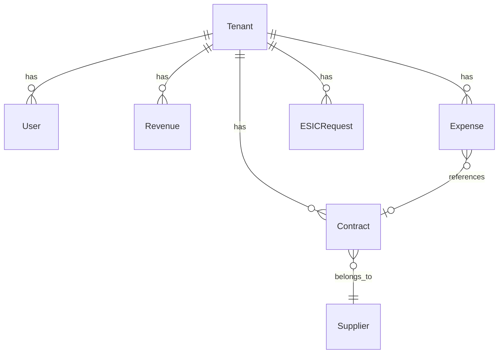

# 🛠️ Guia Técnico de Desenvolvimento

## 📁 Estrutura Detalhada do Projeto

```
saas-transparencia/
├── 🖥️ frontend/                    # Next.js 15 + TypeScript
│   ├── public/                     # Assets estáticos
│   ├── src/
│   │   ├── app/                    # App Router do Next.js 15
│   │   │   ├── admin/              # Páginas administrativas (CRUD)
│   │   │   │   ├── usuarios/       # 👥 CRUD de usuários
│   │   │   │   ├── receitas/       # 💰 CRUD de receitas
│   │   │   │   ├── despesas/       # 💸 CRUD de despesas
│   │   │   │   ├── contratos/      # 📄 CRUD de contratos
│   │   │   │   └── esic/           # 📋 CRUD e-SIC
│   │   │   ├── login/              # 🔐 Autenticação
│   │   │   ├── (public)/           # 🌐 Páginas públicas
│   │   │   └── layout.tsx          # Layout principal
│   │   ├── components/
│   │   │   ├── auth/               # 🔐 Componentes de autenticação
│   │   │   ├── forms/              # 📝 Formulários reutilizáveis
│   │   │   ├── layout/             # 🏗️ Layouts e navegação
│   │   │   └── ui/                 # 🎨 Componentes base (Modal, etc)
│   │   ├── contexts/               # ⚡ React Contexts
│   │   ├── hooks/                  # 🪝 Custom React Hooks
│   │   ├── lib/                    # 🔧 Utilities e configurações
│   │   ├── types/                  # 📝 TypeScript interfaces
│   │   └── utils/                  # 🛠️ Funções auxiliares
│   ├── tailwind.config.js          # 🎨 Configuração do Tailwind
│   ├── next.config.ts              # ⚙️ Configuração do Next.js 15
│   └── package.json                # 📦 Dependências frontend
├── 🔧 backend/                     # FastAPI + Python 3.11
│   ├── app/
│   │   ├── api/
│   │   │   └── api_v1/
│   │   │       ├── endpoints/      # 🛣️ Rotas da API
│   │   │       │   ├── auth.py     # 🔐 Autenticação JWT
│   │   │       │   ├── users.py    # 👥 CRUD usuários
│   │   │       │   ├── financial.py # 💰 Receitas/Despesas
│   │   │       │   ├── contracts.py # 📄 Contratos
│   │   │       │   └── esic.py     # 📋 e-SIC
│   │   │       └── api.py          # 🚀 Router principal
│   │   ├── core/                   # ⚙️ Configurações core
│   │   │   ├── config.py           # 🔧 Settings & Environment
│   │   │   ├── database.py         # 🗃️ Conexão PostgreSQL
│   │   │   └── security.py         # 🔒 JWT e Password hashing
│   │   ├── models/                 # 🏗️ SQLAlchemy models
│   │   ├── schemas/                # 📝 Pydantic schemas
│   │   ├── services/               # 💼 Business logic layer
│   │   └── utils/                  # 🛠️ Utilities
│   ├── alembic/                    # 🔄 Migrações do banco
│   ├── requirements.txt            # 📋 Dependências Python
│   └── Dockerfile                  # 🐳 Container backend
├── 🐘 docker/                      # 🐳 Configurações Docker
│   ├── nginx/                      # 🌐 Configuração Nginx
│   └── postgres/                   # 🗄️ Scripts PostgreSQL
├── 📋 docs/                        # 📚 Documentação completa
├── 🧪 scripts/                     # ⚡ Scripts utilitários
├── docker-compose.yml              # 🐳 Orquestração completa
├── heroku.yml                      # ☁️ Deploy Heroku
└── README.md                       # 📖 Documentação principal
```

## 🏗️ Arquitetura Avançada

### Stack Tecnológico Completo

- **Backend**: Python 3.11 + FastAPI + SQLAlchemy + Alembic
- **Frontend**: Next.js 15 + TypeScript + Tailwind CSS + Headless UI
- **Banco de Dados**: PostgreSQL 15 com índices otimizados
- **Autenticação**: JWT + bcrypt password hashing
- **Containerização**: Docker + Docker Compose
- **Proxy Reverso**: Nginx com SSL termination
- **Deploy**: Heroku + GitHub Actions CI/CD

## 🚀 Setup de Desenvolvimento

### Pré-requisitos

- Docker 20.10+
- Docker Compose 2.0+
- Node.js 18+ (para desenvolvimento frontend)
- Python 3.11+ (para desenvolvimento backend)

### Instalação Rápida

```bash
# Clone o repositório
git clone <repository-url>
cd saas-transparencia

# Execute o script de setup
chmod +x scripts/setup.sh
./scripts/setup.sh
```

### Setup Manual

#### 1. Configuração do Ambiente

```bash
# Copie o arquivo de exemplo
cp .env.example .env

# Edite as configurações conforme necessário
nano .env
```

#### 2. Backend (FastAPI)

```bash
cd backend

# Crie ambiente virtual
python -m venv venv
source venv/bin/activate  # Linux/Mac
# ou
venv\Scripts\activate     # Windows

# Instale dependências
pip install -r requirements.txt

# Execute migrações
alembic upgrade head

# Inicie o servidor
uvicorn app.main:app --reload --port 8000
```

#### 3. Frontend (Next.js)

```bash
cd frontend

# Instale dependências
npm install

# Inicie o servidor de desenvolvimento
npm run dev
```

#### 4. Serviços com Docker

```bash
# Inicie apenas os serviços de infraestrutura
docker-compose up -d postgres redis elasticsearch minio

# Ou todos os serviços
docker-compose up -d
```

## 🔧 Desenvolvimento

### Backend (FastAPI)

#### Estrutura de Arquivos

```python
# app/models/exemplo.py - Modelo SQLAlchemy
from sqlalchemy import Column, Integer, String
from app.models.base import TenantBaseModel

class Exemplo(TenantBaseModel):
    __tablename__ = "exemplos"
    
    nome = Column(String(255), nullable=False)
    descricao = Column(String(500), nullable=True)
```

```python
# app/schemas/exemplo.py - Schema Pydantic
from pydantic import BaseModel
from typing import Optional

class ExemploBase(BaseModel):
    nome: str
    descricao: Optional[str] = None

class ExemploCreate(ExemploBase):
    pass

class Exemplo(ExemploBase):
    id: int
    tenant_id: int
    
    class Config:
        from_attributes = True
```

```python
# app/services/exemplo_service.py - Serviço
from app.services.base_service import BaseService
from app.models.exemplo import Exemplo
from app.schemas.exemplo import ExemploCreate, ExemploUpdate

class ExemploService(BaseService[Exemplo, ExemploCreate, ExemploUpdate]):
    def __init__(self, db: AsyncSession):
        super().__init__(Exemplo, db)
```

```python
# app/api/api_v1/endpoints/exemplo.py - Endpoint
from fastapi import APIRouter, Depends
from app.services.exemplo_service import ExemploService
from app.schemas.exemplo import Exemplo, ExemploCreate

router = APIRouter()

@router.post("/", response_model=Exemplo)
async def create_exemplo(
    exemplo: ExemploCreate,
    service: ExemploService = Depends()
):
    return await service.create(exemplo)
```

#### Migrações

```bash
# Criar nova migração
alembic revision --autogenerate -m "Descrição da mudança"

# Aplicar migrações
alembic upgrade head

# Reverter migração
alembic downgrade -1
```

#### Testes

```bash
# Executar todos os testes
pytest

# Executar com coverage
pytest --cov=app

# Executar testes específicos
pytest tests/test_exemplo.py
```

### Frontend (Next.js 15 + TypeScript)

#### 🎯 Padrões Arquiteturais

- **App Router**: Nova estrutura de roteamento do Next.js 15 com layout aninhados
- **Server Components**: Renderização no servidor por padrão para melhor SEO
- **Custom Hooks**: Lógica de estado isolada e reutilizável (`useUsers`, `useContracts`, etc.)
- **Context API**: Gerenciamento de estado global com `AuthContext`
- **Tailwind CSS**: Sistema de design utilitário e totalmente responsivo
- **Headless UI**: Componentes acessíveis e sem estilo pré-definido

#### 🔗 Custom Hooks Pattern

```typescript
// Exemplo: hooks/useUsers.ts
import { useState, useEffect } from 'react';
import { api } from '@/lib/api';
import { User, CreateUserData, UpdateUserData } from '@/types';

export const useUsers = () => {
  const [users, setUsers] = useState<User[]>([]);
  const [loading, setLoading] = useState(false);
  const [error, setError] = useState<string | null>(null);
  
  const fetchUsers = async () => {
    setLoading(true);
    try {
      const data = await api.get<User[]>('/users');
      setUsers(data);
    } catch (err) {
      setError(err instanceof Error ? err.message : 'Erro desconhecido');
    } finally {
      setLoading(false);
    }
  };
  
  const createUser = async (userData: CreateUserData) => {
    try {
      const newUser = await api.post<User>('/users', userData);
      setUsers(prev => [...prev, newUser]);
      return newUser;
    } catch (err) {
      throw new Error(err instanceof Error ? err.message : 'Erro ao criar usuário');
    }
  };
  
  const updateUser = async (id: number, userData: UpdateUserData) => {
    try {
      const updatedUser = await api.put<User>(`/users/${id}`, userData);
      setUsers(prev => prev.map(user => 
        user.id === id ? updatedUser : user
      ));
      return updatedUser;
    } catch (err) {
      throw new Error(err instanceof Error ? err.message : 'Erro ao atualizar usuário');
    }
  };
  
  const deleteUser = async (id: number) => {
    try {
      await api.delete(`/users/${id}`);
      setUsers(prev => prev.filter(user => user.id !== id));
    } catch (err) {
      throw new Error(err instanceof Error ? err.message : 'Erro ao deletar usuário');
    }
  };
  
  useEffect(() => {
    fetchUsers();
  }, []);
  
  return {
    users,
    loading,
    error,
    fetchUsers,
    createUser,
    updateUser,
    deleteUser
  };
};
```

#### 🎨 Sistema de Design & UI

- **Paleta de Cores**: Sistema baseado em Tailwind com cores semânticas
- **Tipografia**: Inter (Google Fonts) com hierarquia clara
- **Iconografia**: Heroicons v2 para consistência visual
- **Componentes**: Headless UI + Tailwind para acessibilidade
- **Layout**: CSS Grid + Flexbox para layouts responsivos
- **Estados**: Loading, Error, Success states para melhor UX

```typescript
// Exemplo: components/ui/Modal.tsx
import { Fragment } from 'react';
import { Dialog, Transition } from '@headlessui/react';
import { XMarkIcon } from '@heroicons/react/24/outline';

interface ModalProps {
  isOpen: boolean;
  onClose: () => void;
  title: string;
  children: React.ReactNode;
}

export function Modal({ isOpen, onClose, title, children }: ModalProps) {
  return (
    <Transition appear show={isOpen} as={Fragment}>
      <Dialog as="div" className="relative z-50" onClose={onClose}>
        <Transition.Child
          as={Fragment}
          enter="ease-out duration-300"
          enterFrom="opacity-0"
          enterTo="opacity-100"
          leave="ease-in duration-200"
          leaveFrom="opacity-100"
          leaveTo="opacity-0"
        >
          <div className="fixed inset-0 bg-black/25" />
        </Transition.Child>

        <div className="fixed inset-0 overflow-y-auto">
          <div className="flex min-h-full items-center justify-center p-4 text-center">
            <Transition.Child
              as={Fragment}
              enter="ease-out duration-300"
              enterFrom="opacity-0 scale-95"
              enterTo="opacity-100 scale-100"
              leave="ease-in duration-200"
              leaveFrom="opacity-100 scale-100"
              leaveTo="opacity-0 scale-95"
            >
              <Dialog.Panel className="w-full max-w-md transform overflow-hidden rounded-2xl bg-white p-6 text-left align-middle shadow-xl transition-all">
                <div className="flex items-center justify-between">
                  <Dialog.Title className="text-lg font-medium leading-6 text-gray-900">
                    {title}
                  </Dialog.Title>
                  <button
                    onClick={onClose}
                    className="rounded-md text-gray-400 hover:text-gray-500"
                  >
                    <XMarkIcon className="h-5 w-5" />
                  </button>
                </div>
                <div className="mt-4">
                  {children}
                </div>
              </Dialog.Panel>
            </Transition.Child>
          </div>
        </div>
      </Dialog>
    </Transition>
  );
}
```

### Backend (FastAPI + Python)

#### 🏛️ Padrões Arquiteturais Avançados

- **Repository Pattern**: Abstração completa de acesso a dados
- **Service Layer Pattern**: Lógica de negócio isolada e testável
- **Dependency Injection**: Sistema robusto de injeção de dependências
- **Pydantic Schemas**: Validação automática e serialização de dados
- **SQLAlchemy ORM**: Mapeamento objeto-relacional com relacionamentos
- **Async/Await**: Programação assíncrona para alta performance

#### 🔐 Sistema de Segurança Avançado

```python
# core/security.py - Sistema JWT completo
from datetime import datetime, timedelta
from typing import Optional, Union
from jose import JWTError, jwt
from passlib.context import CryptContext
from fastapi import HTTPException, status

# Context para hashing de senhas
pwd_context = CryptContext(schemes=["bcrypt"], deprecated="auto")

SECRET_KEY = "your-secret-key-here"
ALGORITHM = "HS256"
ACCESS_TOKEN_EXPIRE_MINUTES = 30

def verify_password(plain_password: str, hashed_password: str) -> bool:
    """Verifica se a senha está correta"""
    return pwd_context.verify(plain_password, hashed_password)

def get_password_hash(password: str) -> str:
    """Gera hash da senha"""
    return pwd_context.hash(password)

def create_access_token(data: dict, expires_delta: Optional[timedelta] = None):
    """Cria token JWT de acesso"""
    to_encode = data.copy()
    if expires_delta:
        expire = datetime.utcnow() + expires_delta
    else:
        expire = datetime.utcnow() + timedelta(minutes=ACCESS_TOKEN_EXPIRE_MINUTES)
    
    to_encode.update({"exp": expire})
    encoded_jwt = jwt.encode(to_encode, SECRET_KEY, algorithm=ALGORITHM)
    return encoded_jwt

def verify_token(token: str) -> Optional[dict]:
    """Verifica e decodifica token JWT"""
    try:
        payload = jwt.decode(token, SECRET_KEY, algorithms=[ALGORITHM])
        username: str = payload.get("sub")
        if username is None:
            return None
        return payload
    except JWTError:
        return None

# Dependency para autenticação
async def get_current_user(token: str = Depends(oauth2_scheme)):
    credentials_exception = HTTPException(
        status_code=status.HTTP_401_UNAUTHORIZED,
        detail="Could not validate credentials",
        headers={"WWW-Authenticate": "Bearer"},
    )
    
    payload = verify_token(token)
    if payload is None:
        raise credentials_exception
    
    # Buscar usuário no banco de dados
    user = await user_service.get_by_username(payload.get("sub"))
    if user is None:
        raise credentials_exception
    
    return user
```

#### 📊 Service Layer Pattern

```python
# services/base_service.py - Serviço base genérico
from typing import Generic, TypeVar, Type, Optional, List
from sqlalchemy.ext.asyncio import AsyncSession
from sqlalchemy.future import select
from sqlalchemy.orm import selectinload
from pydantic import BaseModel

ModelType = TypeVar("ModelType")
CreateSchemaType = TypeVar("CreateSchemaType", bound=BaseModel)
UpdateSchemaType = TypeVar("UpdateSchemaType", bound=BaseModel)

class BaseService(Generic[ModelType, CreateSchemaType, UpdateSchemaType]):
    def __init__(self, model: Type[ModelType], db: AsyncSession):
        self.model = model
        self.db = db

    async def get(self, id: int) -> Optional[ModelType]:
        """Busca por ID"""
        result = await self.db.execute(
            select(self.model).where(self.model.id == id)
        )
        return result.scalar_one_or_none()

    async def get_multi(
        self, skip: int = 0, limit: int = 100
    ) -> List[ModelType]:
        """Lista com paginação"""
        result = await self.db.execute(
            select(self.model).offset(skip).limit(limit)
        )
        return result.scalars().all()

    async def create(self, obj_in: CreateSchemaType) -> ModelType:
        """Cria novo registro"""
        obj_data = obj_in.model_dump()
        db_obj = self.model(**obj_data)
        self.db.add(db_obj)
        await self.db.commit()
        await self.db.refresh(db_obj)
        return db_obj

    async def update(
        self, db_obj: ModelType, obj_in: UpdateSchemaType
    ) -> ModelType:
        """Atualiza registro existente"""
        obj_data = obj_in.model_dump(exclude_unset=True)
        for field, value in obj_data.items():
            setattr(db_obj, field, value)
        
        await self.db.commit()
        await self.db.refresh(db_obj)
        return db_obj

    async def delete(self, id: int) -> bool:
        """Remove registro"""
        obj = await self.get(id)
        if obj:
            await self.db.delete(obj)
            await self.db.commit()
            return True
        return False

# services/user_service.py - Serviço específico de usuários
from app.models.user import User
from app.schemas.user import UserCreate, UserUpdate
from app.core.security import get_password_hash, verify_password

class UserService(BaseService[User, UserCreate, UserUpdate]):
    def __init__(self, db: AsyncSession):
        super().__init__(User, db)

    async def get_by_email(self, email: str) -> Optional[User]:
        """Busca usuário por email"""
        result = await self.db.execute(
            select(User).where(User.email == email)
        )
        return result.scalar_one_or_none()

    async def create(self, obj_in: UserCreate) -> User:
        """Cria usuário com senha hasheada"""
        obj_data = obj_in.model_dump()
        obj_data["hashed_password"] = get_password_hash(obj_data.pop("password"))
        
        db_obj = User(**obj_data)
        self.db.add(db_obj)
        await self.db.commit()
        await self.db.refresh(db_obj)
        return db_obj

    async def authenticate(self, email: str, password: str) -> Optional[User]:
        """Autentica usuário"""
        user = await self.get_by_email(email)
        if not user:
            return None
        if not verify_password(password, user.hashed_password):
            return None
        return user
```

## 🧪 Testes

### Backend

```python
# tests/test_exemplo.py
import pytest
from httpx import AsyncClient
from app.main import app

@pytest.mark.asyncio
async def test_create_exemplo():
    async with AsyncClient(app=app, base_url="http://test") as ac:
        response = await ac.post(
            "/api/v1/exemplos/",
            json={"nome": "Teste", "descricao": "Descrição teste"}
        )
    assert response.status_code == 200
    assert response.json()["nome"] == "Teste"
```

### Frontend

```tsx
// __tests__/Button.test.tsx
import { render, screen, fireEvent } from '@testing-library/react';
import { Button } from '@/components/ui/Button';

describe('Button', () => {
  it('renders correctly', () => {
    render(<Button>Click me</Button>);
    expect(screen.getByText('Click me')).toBeInTheDocument();
  });

  it('calls onClick when clicked', () => {
    const handleClick = jest.fn();
    render(<Button onClick={handleClick}>Click me</Button>);
    
    fireEvent.click(screen.getByText('Click me'));
    expect(handleClick).toHaveBeenCalledTimes(1);
  });
});
```

## 📊 Banco de Dados

### Modelos Principais

1. **User**: Usuários do sistema
2. **Tenant**: Municípios (multi-tenancy)
3. **Revenue**: Receitas municipais
4. **Expense**: Despesas municipais
5. **Contract**: Contratos e licitações
6. **ESICRequest**: Pedidos e-SIC
7. **Supplier**: Fornecedores

### Relacionamentos



## 🔐 Autenticação e Autorização

### JWT Tokens

```python
# Gerar token
from app.core.security import create_access_token

token = create_access_token(subject=user.id)
```

### Middleware de Autenticação

```python
# Proteger endpoint
from app.core.security import get_current_user

@router.get("/protected")
async def protected_route(
    current_user: User = Depends(get_current_user)
):
    return {"message": f"Hello {current_user.email}"}
```

### Roles e Permissões

- **SUPERUSER**: Acesso total ao sistema
- **ADMIN**: Administração do tenant
- **MANAGER**: Gestão de dados
- **OPERATOR**: Operação básica
- **VIEWER**: Apenas visualização

## 🌐 APIs Externas

### Integração com Sistemas Contábeis

```python
# app/services/integration_service.py
class IntegrationService:
    async def import_siafi_data(self, tenant_id: int):
        # Importar dados do SIAFI
        pass
    
    async def export_to_tribunal(self, tenant_id: int):
        # Exportar para Tribunal de Contas
        pass
```

## 📈 Performance

### Cache com Redis

```python
# app/services/cache_service.py
import redis
from app.core.config import settings

redis_client = redis.from_url(settings.REDIS_URL)

async def get_cached_data(key: str):
    return redis_client.get(key)

async def set_cached_data(key: str, value: str, ttl: int = 300):
    return redis_client.setex(key, ttl, value)
```

### Otimização de Queries

```python
# Usar select relacionados
from sqlalchemy.orm import selectinload

query = select(Contract).options(
    selectinload(Contract.supplier),
    selectinload(Contract.expenses)
)
```

## 🔍 Busca com Elasticsearch

```python
# app/services/search_service.py
from elasticsearch import AsyncElasticsearch

class SearchService:
    def __init__(self):
        self.es = AsyncElasticsearch([settings.ELASTICSEARCH_URL])
    
    async def search_expenses(self, query: str, tenant_id: int):
        body = {
            "query": {
                "bool": {
                    "must": [
                        {"match": {"description": query}},
                        {"term": {"tenant_id": tenant_id}}
                    ]
                }
            }
        }
        return await self.es.search(index="expenses", body=body)
```

## 📱 Responsividade

### Breakpoints Tailwind

```css
/* Mobile first */
.container {
  @apply px-4;
}

/* Tablet */
@screen md {
  .container {
    @apply px-6;
  }
}

/* Desktop */
@screen lg {
  .container {
    @apply px-8;
  }
}
```

## ♿ Acessibilidade

### Diretrizes WCAG 2.1

1. **Perceptível**: Alt text, contraste, legendas
2. **Operável**: Navegação por teclado, sem epilepsia
3. **Compreensível**: Linguagem clara, previsível
4. **Robusto**: Compatível com tecnologias assistivas

```tsx
// Exemplo de componente acessível
<button
  aria-label="Fechar modal"
  aria-describedby="modal-description"
  onClick={onClose}
>
  <XIcon aria-hidden="true" />
</button>
```

## 🛠️ Ferramentas de Desenvolvimento

### Linting e Formatação

```bash
# Backend
black .                    # Formatação
isort .                    # Imports
flake8 .                   # Linting
mypy .                     # Type checking

# Frontend
npm run lint               # ESLint
npm run format             # Prettier
```

### Pre-commit Hooks

```yaml
# .pre-commit-config.yaml
repos:
  - repo: https://github.com/psf/black
    rev: 22.3.0
    hooks:
      - id: black
  - repo: https://github.com/pycqa/isort
    rev: 5.10.1
    hooks:
      - id: isort
```

## 📝 Documentação da API

A documentação interativa está disponível em:
- **Swagger UI**: http://localhost:8000/docs
- **ReDoc**: http://localhost:8000/redoc

### Exemplo de Documentação

```python
@router.post(
    "/",
    response_model=Expense,
    summary="Criar nova despesa",
    description="Cria uma nova despesa municipal conforme LC 131/09",
    responses={
        201: {"description": "Despesa criada com sucesso"},
        400: {"description": "Dados inválidos"},
        401: {"description": "Não autorizado"},
    }
)
async def create_expense(expense: ExpenseCreate):
    """
    Criar nova despesa municipal.
    
    Campos obrigatórios conforme LC 131/09:
    - description: Descrição da despesa
    - amount: Valor da despesa
    - beneficiary_name: Nome do beneficiário
    - process_number: Número do processo
    """
    pass
```

## 🚨 Troubleshooting

### Problemas Comuns

1. **Erro de conexão com banco**
   ```bash
   # Verificar se PostgreSQL está rodando
   docker-compose ps postgres
   
   # Verificar logs
   docker-compose logs postgres
   ```

2. **Erro de migração**
   ```bash
   # Resetar migrações (CUIDADO!)
   alembic downgrade base
   alembic upgrade head
   ```

3. **Erro de CORS**
   ```python
   # Verificar configuração no settings
   CORS_ORIGINS = ["http://localhost:3000"]
   ```

### Logs e Debug

```python
# Habilitar logs SQL
import logging
logging.getLogger('sqlalchemy.engine').setLevel(logging.INFO)

# Debug no FastAPI
uvicorn app.main:app --reload --log-level debug
```

