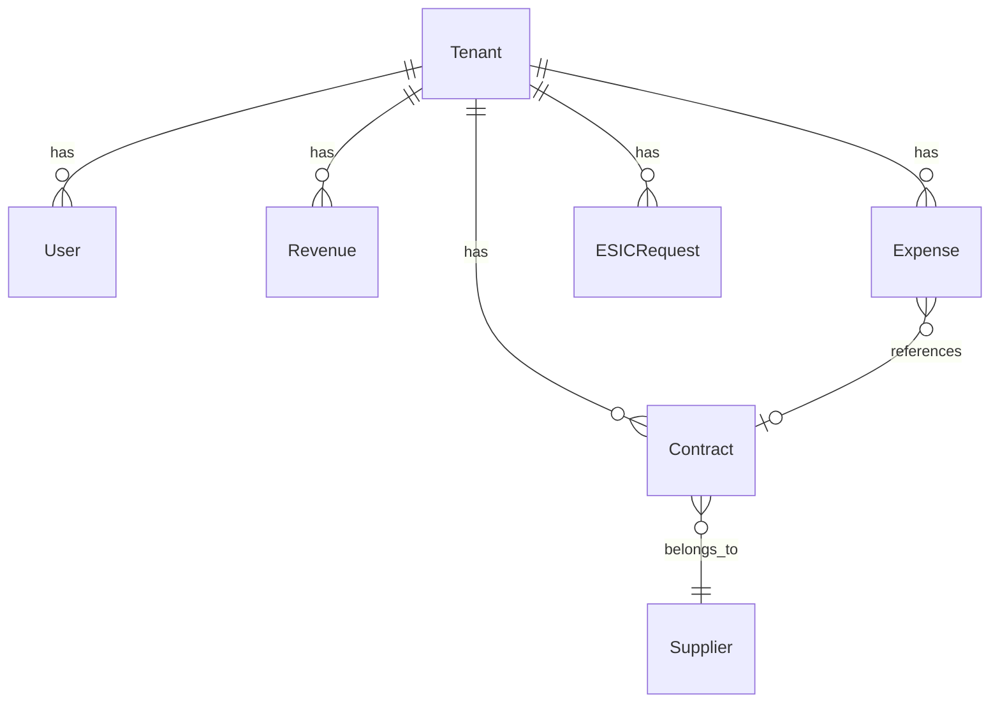

# Guia de Desenvolvimento - SaaS de Portais de Transparência

## 🏗️ Arquitetura

### Stack Tecnológico

- **Backend**: Python 3.11 + FastAPI
- **Frontend**: Next.js 14 + TypeScript + Tailwind CSS
- **Banco de Dados**: PostgreSQL 15
- **Cache**: Redis 7
- **Busca**: Elasticsearch 8
- **Storage**: MinIO (S3-compatible)
- **Queue**: Celery + Redis
- **Containerização**: Docker + Docker Compose

### Estrutura do Projeto

```
saas-transparencia/
├── backend/                 # API FastAPI
│   ├── app/
│   │   ├── api/            # Endpoints da API
│   │   ├── core/           # Configurações e segurança
│   │   ├── models/         # Modelos SQLAlchemy
│   │   ├── schemas/        # Schemas Pydantic
│   │   ├── services/       # Lógica de negócio
│   │   └── utils/          # Utilitários
│   ├── alembic/            # Migrações do banco
│   ├── tests/              # Testes
│   └── requirements.txt    # Dependências Python
├── frontend/               # App Next.js
│   ├── src/
│   │   ├── app/           # App Router (Next.js 13+)
│   │   ├── components/    # Componentes React
│   │   ├── lib/           # Bibliotecas e utilitários
│   │   ├── hooks/         # Custom hooks
│   │   └── types/         # Tipos TypeScript
│   └── package.json       # Dependências Node.js
├── docker/                # Configurações Docker
├── scripts/               # Scripts de automação
└── docs/                  # Documentação
```

## 🚀 Setup de Desenvolvimento

### Pré-requisitos

- Docker 20.10+
- Docker Compose 2.0+
- Node.js 18+ (para desenvolvimento frontend)
- Python 3.11+ (para desenvolvimento backend)

### Instalação Rápida

```bash
# Clone o repositório
git clone <repository-url>
cd saas-transparencia

# Execute o script de setup
chmod +x scripts/setup.sh
./scripts/setup.sh
```

### Setup Manual

#### 1. Configuração do Ambiente

```bash
# Copie o arquivo de exemplo
cp .env.example .env

# Edite as configurações conforme necessário
nano .env
```

#### 2. Backend (FastAPI)

```bash
cd backend

# Crie ambiente virtual
python -m venv venv
source venv/bin/activate  # Linux/Mac
# ou
venv\Scripts\activate     # Windows

# Instale dependências
pip install -r requirements.txt

# Execute migrações
alembic upgrade head

# Inicie o servidor
uvicorn app.main:app --reload --port 8000
```

#### 3. Frontend (Next.js)

```bash
cd frontend

# Instale dependências
npm install

# Inicie o servidor de desenvolvimento
npm run dev
```

#### 4. Serviços com Docker

```bash
# Inicie apenas os serviços de infraestrutura
docker-compose up -d postgres redis elasticsearch minio

# Ou todos os serviços
docker-compose up -d
```

## 🔧 Desenvolvimento

### Backend (FastAPI)

#### Estrutura de Arquivos

```python
# app/models/exemplo.py - Modelo SQLAlchemy
from sqlalchemy import Column, Integer, String
from app.models.base import TenantBaseModel

class Exemplo(TenantBaseModel):
    __tablename__ = "exemplos"
    
    nome = Column(String(255), nullable=False)
    descricao = Column(String(500), nullable=True)
```

```python
# app/schemas/exemplo.py - Schema Pydantic
from pydantic import BaseModel
from typing import Optional

class ExemploBase(BaseModel):
    nome: str
    descricao: Optional[str] = None

class ExemploCreate(ExemploBase):
    pass

class Exemplo(ExemploBase):
    id: int
    tenant_id: int
    
    class Config:
        from_attributes = True
```

```python
# app/services/exemplo_service.py - Serviço
from app.services.base_service import BaseService
from app.models.exemplo import Exemplo
from app.schemas.exemplo import ExemploCreate, ExemploUpdate

class ExemploService(BaseService[Exemplo, ExemploCreate, ExemploUpdate]):
    def __init__(self, db: AsyncSession):
        super().__init__(Exemplo, db)
```

```python
# app/api/api_v1/endpoints/exemplo.py - Endpoint
from fastapi import APIRouter, Depends
from app.services.exemplo_service import ExemploService
from app.schemas.exemplo import Exemplo, ExemploCreate

router = APIRouter()

@router.post("/", response_model=Exemplo)
async def create_exemplo(
    exemplo: ExemploCreate,
    service: ExemploService = Depends()
):
    return await service.create(exemplo)
```

#### Migrações

```bash
# Criar nova migração
alembic revision --autogenerate -m "Descrição da mudança"

# Aplicar migrações
alembic upgrade head

# Reverter migração
alembic downgrade -1
```

#### Testes

```bash
# Executar todos os testes
pytest

# Executar com coverage
pytest --cov=app

# Executar testes específicos
pytest tests/test_exemplo.py
```

### Frontend (Next.js)

#### Estrutura de Componentes

```tsx
// src/components/ui/Button.tsx - Componente base
interface ButtonProps {
  children: React.ReactNode;
  variant?: 'primary' | 'secondary';
  onClick?: () => void;
}

export function Button({ children, variant = 'primary', onClick }: ButtonProps) {
  return (
    <button
      className={`px-4 py-2 rounded ${
        variant === 'primary' ? 'bg-blue-600 text-white' : 'bg-gray-200'
      }`}
      onClick={onClick}
    >
      {children}
    </button>
  );
}
```

```tsx
// src/hooks/useApi.ts - Custom hook para API
import { useState, useEffect } from 'react';
import { apiClient } from '@/lib/api';

export function useApi<T>(url: string) {
  const [data, setData] = useState<T | null>(null);
  const [loading, setLoading] = useState(true);
  const [error, setError] = useState<string | null>(null);

  useEffect(() => {
    const fetchData = async () => {
      try {
        const result = await apiClient.get<T>(url);
        setData(result);
      } catch (err) {
        setError(err instanceof Error ? err.message : 'Erro desconhecido');
      } finally {
        setLoading(false);
      }
    };

    fetchData();
  }, [url]);

  return { data, loading, error };
}
```

#### Páginas

```tsx
// src/app/exemplo/page.tsx - Página
'use client';

import { useApi } from '@/hooks/useApi';
import { Exemplo } from '@/types';

export default function ExemploPage() {
  const { data, loading, error } = useApi<Exemplo[]>('/api/exemplos');

  if (loading) return <div>Carregando...</div>;
  if (error) return <div>Erro: {error}</div>;

  return (
    <div>
      <h1>Exemplos</h1>
      {data?.map((exemplo) => (
        <div key={exemplo.id}>{exemplo.nome}</div>
      ))}
    </div>
  );
}
```

## 🧪 Testes

### Backend

```python
# tests/test_exemplo.py
import pytest
from httpx import AsyncClient
from app.main import app

@pytest.mark.asyncio
async def test_create_exemplo():
    async with AsyncClient(app=app, base_url="http://test") as ac:
        response = await ac.post(
            "/api/v1/exemplos/",
            json={"nome": "Teste", "descricao": "Descrição teste"}
        )
    assert response.status_code == 200
    assert response.json()["nome"] == "Teste"
```

### Frontend

```tsx
// __tests__/Button.test.tsx
import { render, screen, fireEvent } from '@testing-library/react';
import { Button } from '@/components/ui/Button';

describe('Button', () => {
  it('renders correctly', () => {
    render(<Button>Click me</Button>);
    expect(screen.getByText('Click me')).toBeInTheDocument();
  });

  it('calls onClick when clicked', () => {
    const handleClick = jest.fn();
    render(<Button onClick={handleClick}>Click me</Button>);
    
    fireEvent.click(screen.getByText('Click me'));
    expect(handleClick).toHaveBeenCalledTimes(1);
  });
});
```

## 📊 Banco de Dados

### Modelos Principais

1. **User**: Usuários do sistema
2. **Tenant**: Municípios (multi-tenancy)
3. **Revenue**: Receitas municipais
4. **Expense**: Despesas municipais
5. **Contract**: Contratos e licitações
6. **ESICRequest**: Pedidos e-SIC
7. **Supplier**: Fornecedores

### Relacionamentos



## 🔐 Autenticação e Autorização

### JWT Tokens

```python
# Gerar token
from app.core.security import create_access_token

token = create_access_token(subject=user.id)
```

### Middleware de Autenticação

```python
# Proteger endpoint
from app.core.security import get_current_user

@router.get("/protected")
async def protected_route(
    current_user: User = Depends(get_current_user)
):
    return {"message": f"Hello {current_user.email}"}
```

### Roles e Permissões

- **SUPERUSER**: Acesso total ao sistema
- **ADMIN**: Administração do tenant
- **MANAGER**: Gestão de dados
- **OPERATOR**: Operação básica
- **VIEWER**: Apenas visualização

## 🌐 APIs Externas

### Integração com Sistemas Contábeis

```python
# app/services/integration_service.py
class IntegrationService:
    async def import_siafi_data(self, tenant_id: int):
        # Importar dados do SIAFI
        pass
    
    async def export_to_tribunal(self, tenant_id: int):
        # Exportar para Tribunal de Contas
        pass
```

## 📈 Performance

### Cache com Redis

```python
# app/services/cache_service.py
import redis
from app.core.config import settings

redis_client = redis.from_url(settings.REDIS_URL)

async def get_cached_data(key: str):
    return redis_client.get(key)

async def set_cached_data(key: str, value: str, ttl: int = 300):
    return redis_client.setex(key, ttl, value)
```

### Otimização de Queries

```python
# Usar select relacionados
from sqlalchemy.orm import selectinload

query = select(Contract).options(
    selectinload(Contract.supplier),
    selectinload(Contract.expenses)
)
```

## 🔍 Busca com Elasticsearch

```python
# app/services/search_service.py
from elasticsearch import AsyncElasticsearch

class SearchService:
    def __init__(self):
        self.es = AsyncElasticsearch([settings.ELASTICSEARCH_URL])
    
    async def search_expenses(self, query: str, tenant_id: int):
        body = {
            "query": {
                "bool": {
                    "must": [
                        {"match": {"description": query}},
                        {"term": {"tenant_id": tenant_id}}
                    ]
                }
            }
        }
        return await self.es.search(index="expenses", body=body)
```

## 📱 Responsividade

### Breakpoints Tailwind

```css
/* Mobile first */
.container {
  @apply px-4;
}

/* Tablet */
@screen md {
  .container {
    @apply px-6;
  }
}

/* Desktop */
@screen lg {
  .container {
    @apply px-8;
  }
}
```

## ♿ Acessibilidade

### Diretrizes WCAG 2.1

1. **Perceptível**: Alt text, contraste, legendas
2. **Operável**: Navegação por teclado, sem epilepsia
3. **Compreensível**: Linguagem clara, previsível
4. **Robusto**: Compatível com tecnologias assistivas

```tsx
// Exemplo de componente acessível
<button
  aria-label="Fechar modal"
  aria-describedby="modal-description"
  onClick={onClose}
>
  <XIcon aria-hidden="true" />
</button>
```

## 🛠️ Ferramentas de Desenvolvimento

### Linting e Formatação

```bash
# Backend
black .                    # Formatação
isort .                    # Imports
flake8 .                   # Linting
mypy .                     # Type checking

# Frontend
npm run lint               # ESLint
npm run format             # Prettier
```

### Pre-commit Hooks

```yaml
# .pre-commit-config.yaml
repos:
  - repo: https://github.com/psf/black
    rev: 22.3.0
    hooks:
      - id: black
  - repo: https://github.com/pycqa/isort
    rev: 5.10.1
    hooks:
      - id: isort
```

## 📝 Documentação da API

A documentação interativa está disponível em:
- **Swagger UI**: http://localhost:8000/docs
- **ReDoc**: http://localhost:8000/redoc

### Exemplo de Documentação

```python
@router.post(
    "/",
    response_model=Expense,
    summary="Criar nova despesa",
    description="Cria uma nova despesa municipal conforme LC 131/09",
    responses={
        201: {"description": "Despesa criada com sucesso"},
        400: {"description": "Dados inválidos"},
        401: {"description": "Não autorizado"},
    }
)
async def create_expense(expense: ExpenseCreate):
    """
    Criar nova despesa municipal.
    
    Campos obrigatórios conforme LC 131/09:
    - description: Descrição da despesa
    - amount: Valor da despesa
    - beneficiary_name: Nome do beneficiário
    - process_number: Número do processo
    """
    pass
```

## 🚨 Troubleshooting

### Problemas Comuns

1. **Erro de conexão com banco**
   ```bash
   # Verificar se PostgreSQL está rodando
   docker-compose ps postgres
   
   # Verificar logs
   docker-compose logs postgres
   ```

2. **Erro de migração**
   ```bash
   # Resetar migrações (CUIDADO!)
   alembic downgrade base
   alembic upgrade head
   ```

3. **Erro de CORS**
   ```python
   # Verificar configuração no settings
   CORS_ORIGINS = ["http://localhost:3000"]
   ```

### Logs e Debug

```python
# Habilitar logs SQL
import logging
logging.getLogger('sqlalchemy.engine').setLevel(logging.INFO)

# Debug no FastAPI
uvicorn app.main:app --reload --log-level debug
```

